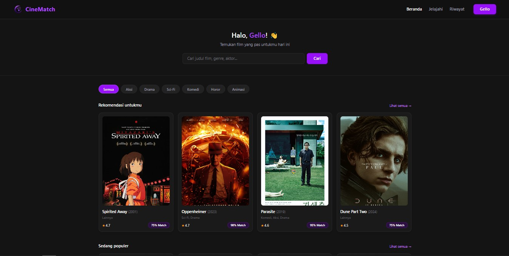
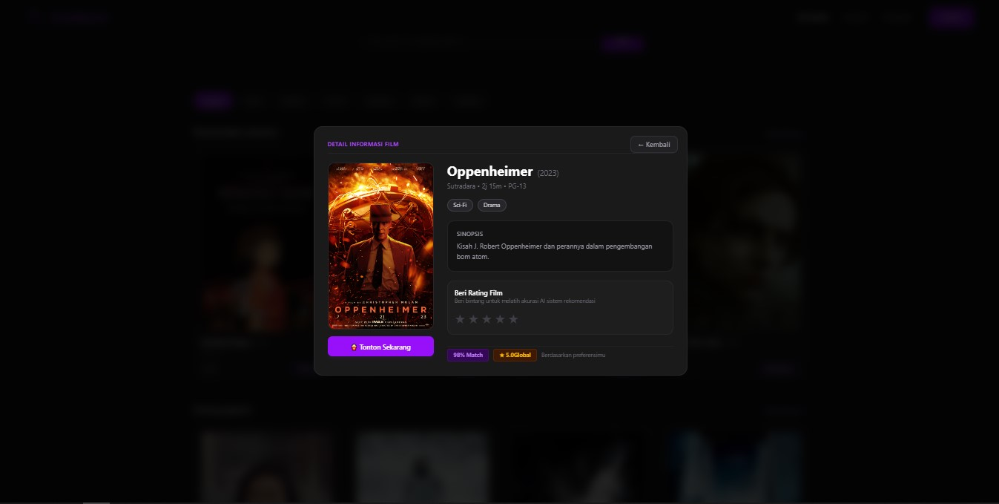
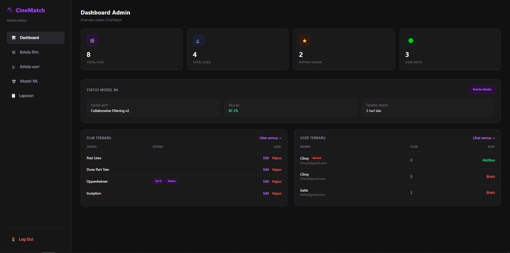
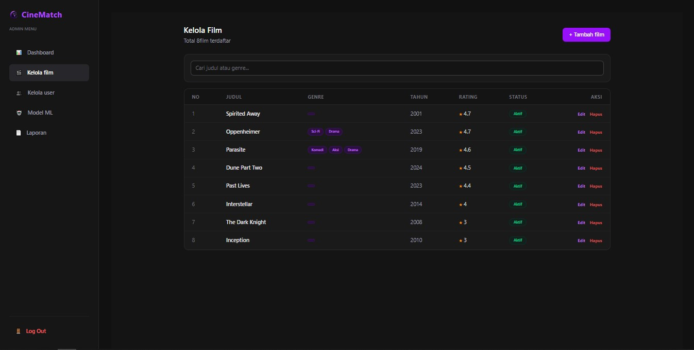

CineMatch adalah sebuah platform untuk membantu pengguna menemukan film yang sesuai dengan selera mereka secara lebih personal dan mudah. Aplikasi ini dirancang dengan arsitektur terpisah (decoupled), yaitu Backend dan Frontend berjalan secara independen. Bagian Backend dibangun menggunakan Laravel sebagai REST API yang bertugas mengelola data dan logika sistem, sedangkan Frontend menggunakan React.js untuk menampilkan antarmuka pengguna yang interaktif dan responsif.

Sistem ini memanfaatkan pendekatan Machine Learning untuk menganalisis data dan preferensi pengguna, sehingga dapat menyarankan film yang paling relevan dengan minat masing-masing individu. Dengan pendekatan ini, pengguna mendapatkan rekomendasi film yang presisi berdasarkan data historis dan preferensi genre yang dipilih.

---

## Pratinjau Antarmuka

Berikut adalah pratinjau antarmuka dari platform CineMatch:

### Halaman Pengguna
| Beranda Utama | Detail Film & Interaksi Rating |
|---|---|
|  |

### Panel Administrasi
| Dashboard Admin | Manajemen Katalog Film |
|---|---|
|  | 

---

## Fitur Utama

### Sisi Pengguna (User)
* **Sistem Pencarian & Filtering:** Melakukan pencarian judul film, aktor, atau melakukan penyaringan spesifik berdasarkan multi-genre secara dinamis.
* **Sistem Rating Interaktif:** Pengguna dapat memberikan penilaian bintang (1-5) untuk melatih akurasi kecocokan sistem rekomendasi AI.
* **Riwayat Tontonan & Statistik:** Halaman riwayat terstruktur yang mengelompokkan film berdasarkan bulan tontonan lengkap dengan metrik rata-rata rating personal.
* **Persentase Kecocokan Dinamis:** Setiap film dilengkapi kalkulasi persentase kesesuaian (% Match) berdasarkan profil preferensi pengguna.

### Sisi Administrator (Admin)
* **Dashboard Metrik Real-Time:** Memantau statistik vital sistem seperti total pengguna terdaftar, jumlah katalog film, total rating masuk, hingga status user aktif.
* **Manajemen Master Data Film (CRUD):** Hak penuh untuk menambah, memperbarui data film beserta unggah berkas poster, menghapus, serta mengubah status publikasi film (Aktif/Nonaktif).
* **Kontrol Akses Pengguna:** Otoritas penuh untuk memantau status pengguna dan melakukan tindakan pemblokiran (banned) secara instan bagi user non-aktif.
* **Monitoring Machine Learning:** Antarmuka pemantauan skor performa model (Akurasi, Precision, Recall, F1-Score) serta kendali penuh untuk memicu proses pelatihan ulang (retrain model).

---

## Teknologi yang Digunakan

### Backend (REST API)


### Frontend (SPA)


---

## 📁 Struktur Project

Proyek ini dibagi menjadi dua repositori/direktori utama yang berdiri sendiri:

```text
CineMatch/
│
├── backend/                  # Laravel REST API
│   ├── app/                  # Controller, Model, Middleware
│   ├── database/             # Migrasi & Seeder (Data Film & Genre)
│   ├── routes/               # api.php (Routing Endpoint API)
│   └── composer.json
│
└── fe-cinema/                # React Vite Frontend
    ├── public/
    ├── src/
    │   ├── api/              # Konfigurasi Axios & Interceptor
    │   ├── views/            # Halaman UI (Auth, Admin, User, Profile)
    │   ├── App.jsx           # Konfigurasi React Router
    │   └── main.jsx
    ├── package.json
    └── vite.config.js
````

⚙️ Cara Instalasi & Menjalankan Aplikasi
Pastikan perangkat sudah terinstal PHP, Composer, Node.js, dan MySQL.

## 1. Konfigurasi Backend (Laravel)
Buka terminal dan arahkan ke direktori backend:

### 0. Masuk ke folder be
```
cd be-cinema
```

### 1. Instal dependensi PHP
```
composer install
```
### 2. Salin file environment dan atur koneksi database (DB_DATABASE, DB_USERNAME, dll)
```
cp .env.example .env
```
#### Atau

```
copy .env.example .env
```

### 3. Generate Application Key
```
php artisan key:generate
```

### 4. Eksekusi migrasi tabel 
```
php artisan migrate:fresh
```

### 5. Seeder Genre & Film
```
php artisan db:seed --class=GenreSeeder
```
```
php artisan db:seed --class=FilmSeeder
```

### 6. Storage Link
```
php artisan storage:link
```

### 7. Jalankan server 
```
php artisan serve
```

## 2. Konfigurasi Frontend (React Vite)
Buka terminal baru dan arahkan ke direktori fe-cinema:

### 0. Masuk ke folder fe
```
cd fe-cinema
```

### 1. Instal semua dependensi Node.js
```
npm install
```

### 2. Jalankan server
```
npm run dev
```

## Lisensi
### Project ini dibuat untuk kebutuhan pengembangan dan pembelajaran akademik.
